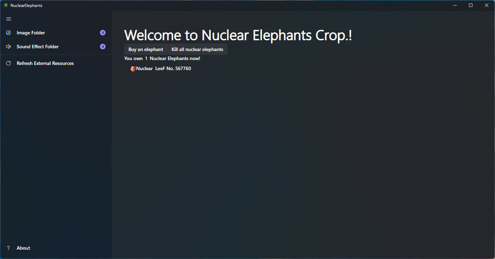
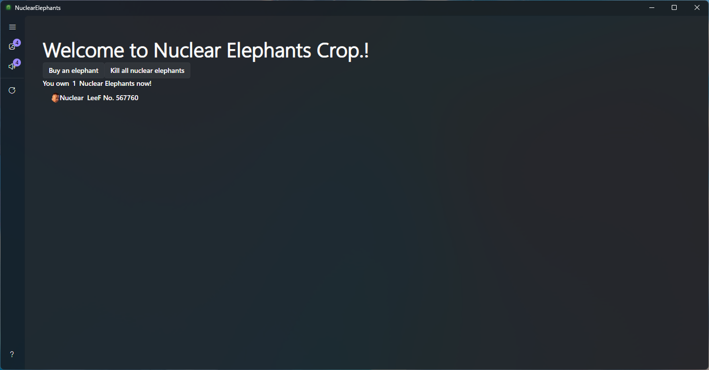

# Nuclear Elephants

  

Nuclear Elephants是一款好评如潮(大概)的Windows动态壁纸软件，用充满能量的核能大象为用户赋能。

## 本软件特色
Nuclear Elephants 致力于倡导科技与自然地融合。例如，将具有**自然**放射性的核能大象与富有**科技**感的电子设备结合起来，让用户可以在电离辐射的光辉下重新思考自己在这个世界中真正的定位。  

Nuclear Elephants 采用将核能大象置于壁纸层的做法，将自身对生产力的影响降到最低，让用户可以在几乎不舍弃任何东西(除了些许的GPU性能)的情况下，打开新世界的大门。
## 食用方法
Nuclear Elephants 开发团队(共1人)注重软件的易用性。  

### 1.购买核能大象
在主界面上，点击 *Buy an elephant* 即可获得一只核能大象。  
*注：该操作并不会让您在现实中的钱包付出同样的代价。*

### 2.清除核能大象
当核能大象数目过多时，您羸弱的电子设备可能会在深厚的哲思中迷失自我，从而分散了用于渲染画面的精力。这时，您只需要轻按主界面上的 *Kill all nuclear elephants* 即可清除您之前购买的核能大象。  
*注：该操作没有额外罚款。核能大象会用自己的能量平等地照亮每一位用户。象门*🙏  

### 3.个性化
核能大象淡泊名利。它从不强求只有自己能出现在用户的桌面上。您可以轻点软件左上角的按钮来打开设置面板。  

您可以轻点 *打开图片文件夹* 来添加您自己准备的图片。若在某个时刻，您对核能大象的思念之情深厚至极，只需清空该文件夹内的图片，核能大象便会重新显现。  

*核能大象从未离去，它一直在那里注视着你*

此外，您可以轻点 *打开音频文件夹* 来添加您自己准备的音频。音频会在您每次按下 *Buy an elephant* 的时候播放。 

### 4.退出
在添加了合适数量的核能大象之后，您可以关闭主窗口，此时程序不会退出。若要完全关闭Nuclear Elephants，请右击托盘图标，选择 *Exit* 。

## ScreenShots
  
  
  
  

## 后记
在开发Nuclear Elephants的过程中，参考了项目[WinWallpaper](https://github.com/Yinmany/WinWallpaper)的部分代码。 

---
# 礼赞核能大象 象门🙏
